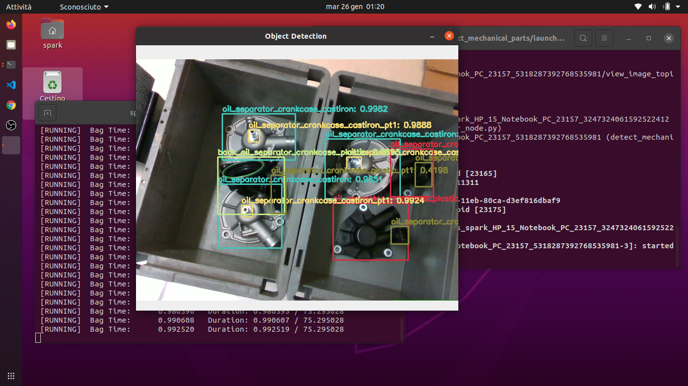

# detect_mechanical_parts

ROS package to read a stream of images, detect mechanical parts of cars using YOLOv4 and view the detection results.
___
## Launch Requirements
* ROS Noetic 1.15.9 (*Recommended for Ubuntu 20.04*)
* Python 3.4+
* OpenCV 4.4.0+
* NumPy 1.17.4+
* Download [yolo-obj.weights](https://drive.google.com/file/d/1rSoWctsJGUFySvskffHQ4HlEMEv7jYyw/view?usp=sharing) and place it in the [yolo_model](yolo_model) folder

## Installation
In order to install detect_mechanical_parts, clone this repository in your catkin workspace and compile the package using ROS.

```shell
$ cd catkin_workspace/src
$ git clone https://github.com/leonard0guerra/detect_mechanical_parts.git
$ cd ..
$ catkin build detect_mechanical_parts
```

## Detection :robot:

1. To launch detect_mechanical_parts run the command:
    ```shell
    $ roslaunch detect_mechanical_parts detect_mechanical_parts.launch
    ```
2. You can download [this bag](https://drive.google.com/file/d/1CngH1nSqTF9j4RZHsccH1meC1ZSXYaKp/view?usp=sharing) and run the command:
    ```shell
    $ rosbag play 20210113_161956.bag --topics /device_0/sensor_1/Color_0/image/data
    ```
You can change the parameters in the [launch file](launch/detect_mechanical_parts.launch) (e.g. topics, confidence threshold value...) and launch it.